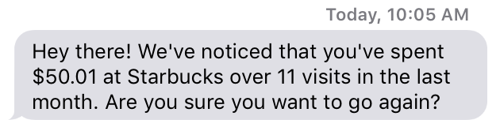

# Spendle

Spendle is an iOS application for smart budgeting. Spendle analyzes your purchase history to determine "bad spending habits" and your location to alert you via text when you approach a bad spending habit area.

For example, say you've ordered at a coffee shop every day for the past month. If you are on your way to that coffee shop, Spendle will send you a text telling you how much you've spent there and encourage you to reevaluate that habit.

## The API

Spendle uses its own API to communicate the web service with the [iOS application](https://github.com/jzarob/spendle-ios "iOS application"). For more information on Spendle's API, check out `docs.md`.

Spendle uses [Twilio](http://twilio.com) to send customized SMS messages to users. 
